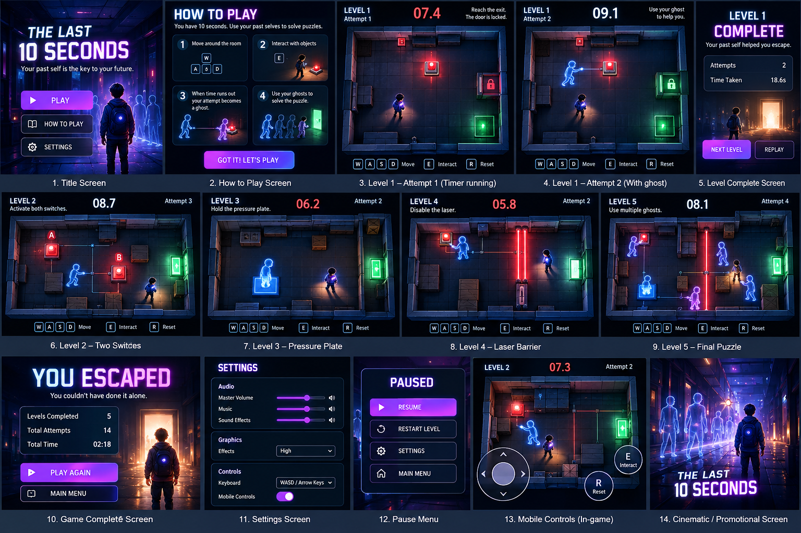
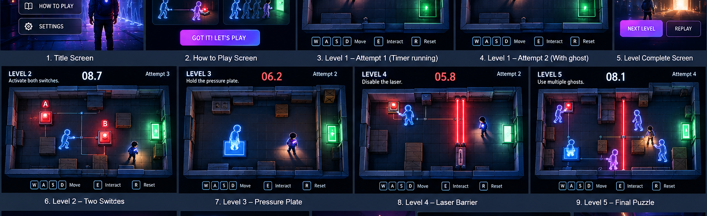
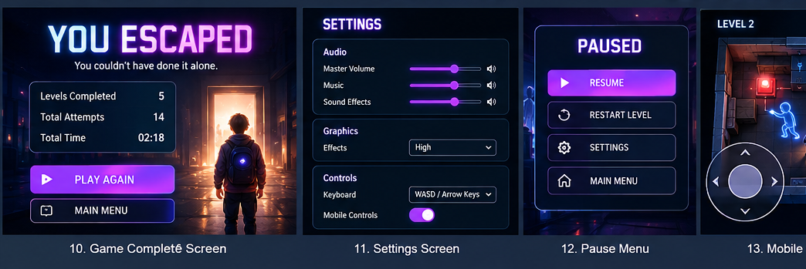
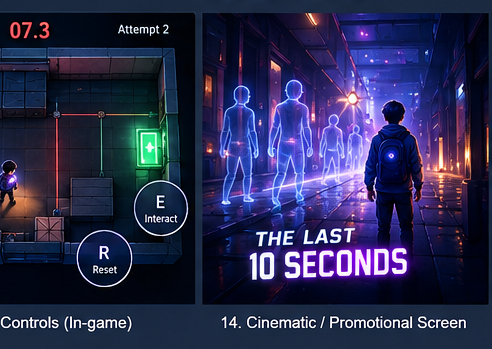

# ⏱️ The Last 10 Seconds

> **Your past self is the key to your future.**

**The Last 10 Seconds** is a cinematic puzzle-game MVP built around one core mechanic:

**You have 10 seconds to act. When the timer ends, your previous attempt becomes a ghost. Use your past selves to solve the next attempt.**

---

## 🎮 Play the MVP

### 👉 [⚡ PLAY THE LAST 10 SECONDS](./index.html)

> If this project is published with GitHub Pages, the same button can be changed to the public Pages URL.

---

## 🧠 Core Gameplay

Every attempt gives the player exactly **10 seconds**.

```text
PLAY
  ↓
10-second attempt
  ↓
Record your movement + interactions
  ↓
Timer reaches 0
  ↓
Previous attempt becomes a ghost 👻
  ↓
Try again
  ↓
Cooperate with your past self
  ↓
OPEN THE EXIT 🚪
```

The important idea is that **failure is not wasted**.

Your failed attempt becomes part of the solution.

---

## ✨ MVP Features

- ⏱️ 10-second time-loop mechanic
- 👻 Previous-attempt ghost replay
- 🎮 Player movement
- 🔴 Interactive switches
- 🔵 Pressure plates
- 🔴 Laser barriers
- 🚪 Locked/unlocked exits
- 🔁 Restart and replay
- 🧩 Multi-attempt puzzle solving
- 🌌 Dark cinematic sci-fi visual direction
- 📱 Mobile-control direction
- 🏆 Level-completion and final escape screens

---

## 🖼️ UI / UX Concept

The following concept board shows the planned visual direction for the game, including the title screen, tutorial, gameplay levels, ghost mechanics, level completion, settings, pause menu, mobile controls, and promotional screen.



---

## 🎮 Gameplay Screens



The MVP progression is designed around increasingly complex cooperation with previous attempts:

1. **Level 1 — One Switch**
   - Your ghost activates the switch.
   - You reach the exit.

2. **Level 2 — Two Switches**
   - Different attempts activate different switches.
   - Multiple ghosts cooperate.

3. **Level 3 — Pressure Plate**
   - A previous self holds the plate.
   - The current player crosses the open route.

4. **Level 4 — Laser Barrier**
   - A previous self disables the laser.
   - The current player crosses safely.

5. **Level 5 — Final Puzzle**
   - Multiple ghosts.
   - Switches + pressure plate + laser.
   - The player must understand the complete time-loop mechanic.

---

## 🏆 Game Completion



After completing the five-level MVP:

> **YOU ESCAPED.**

The game can display:

- Levels completed
- Total attempts
- Total time
- Replay
- Return to main menu

---

## 📱 Mobile Direction



The game can later support:

- Virtual joystick
- Interact button
- Restart button
- Responsive game area

Desktop controls:

| Key | Action |
|---|---|
| `W A S D` | Move |
| `Arrow Keys` | Move |
| `E` | Interact |
| `R` | Restart |

---

## 🛠️ Current MVP Stack

The current uploaded MVP is a browser-based project centered around:

- HTML
- CSS
- JavaScript / browser APIs
- No backend required for the core game concept
- No database required for the MVP

The project is intentionally small so the **time-loop mechanic** remains the focus.

---

## 🚀 Run Locally

Clone or download the project, then open:

```text
index.html
```

For a local development server, you can also use VS Code Live Server or:

```bash
python -m http.server 5500
```

Then open:

```text
http://localhost:5500
```

---

## 🌐 Publish With GitHub Pages

1. Create a GitHub repository.
2. Upload:
   - `index.html`
   - `README.md`
   - `assets/`
3. Go to:

```text
Settings → Pages
```

4. Select:

```text
Deploy from a branch
Branch: main
Folder: / (root)
```

5. Save.

GitHub will provide a public URL similar to:

```text
https://YOUR-USERNAME.github.io/YOUR-REPOSITORY/
```

Then replace the `PLAY THE LAST 10 SECONDS` link near the top of this README with that public URL.

---

## 🎯 MVP Scope

### Included

- Core 10-second loop
- Ghost replay concept
- Puzzle rooms
- Switches
- Pressure plates
- Lasers
- Exit system
- Five-level progression
- Cinematic UI direction

### Not Included Yet

- Multiplayer
- Online leaderboard
- Accounts
- Backend
- Database
- AI opponents
- Open world
- Inventory
- Character customization
- Advanced story system

---

## 🔮 Future Versions

### V2 — More Puzzle Mechanics
- Moving platforms
- Multiple simultaneous ghosts
- Doors with timing windows
- Moving lasers
- Environmental hazards

### V3 — Story Mode
- Story chapters
- Mystery surrounding the time loop
- Cinematic sequences
- Character dialogue

### V4 — Online Features
- Global leaderboard
- Best-attempt records
- Speedrun mode
- Community-created levels

---

## 💡 The Big Idea

Most games treat failure as:

> **GAME OVER**

**The Last 10 Seconds** treats failure as:

> **NEW TOOL UNLOCKED**

Every failed attempt gives you another version of yourself.

And eventually:

**You realize you were never playing alone.**

---

## 📄 Project Status

**MVP / Prototype**

The visual images in this README are **concept/UI reference images generated for the project**. They represent the intended design direction and should not be treated as proof that every visual shown is already implemented in the current `index.html`.

---

## 👤 Project

**The Last 10 Seconds**

A small experimental puzzle game focused on time, repetition, and cooperation with your past self.
